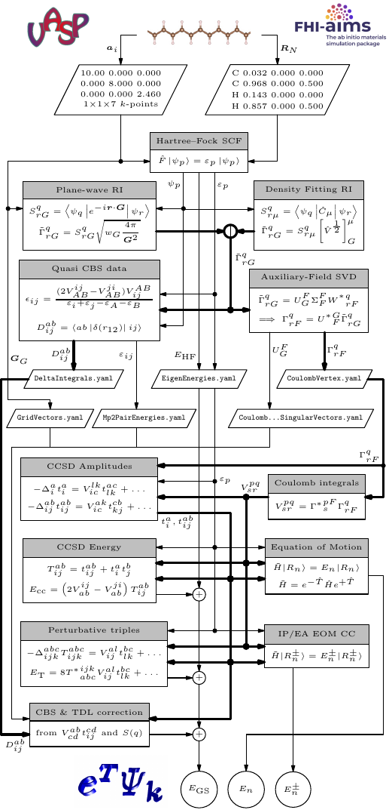

## Summary of WP3-related discussion at Riga hackathon Friday 17 - Monday 20 June 2022 

* Task 1 of WP3 is to create interfaces between Cc4s and representative ab-initio codes from all code families (NAO, FLAPW, PAW)
* As part of WP3 an interface between Cc4s and FHI-aims (NAO) has already been published
* Next steps will involve the creation of interfaces to *Exciting* (FLAPW) and *ABINIT* (PAW)

The interfaces to ABINIT and Exciting will be created in collaboration with UCL and HUB, respectively.

## Description of Interface between Cc4s and Exciting/ABINIT/...

Similar to the [FHI-aims interface](https://gitlab.com/moerman1/fhi-cc4s), new interfaces need
to focus on producing the most important input files for Cc4s, accounting for the specifics of the representation of one-electron states (PAW, FLAPW).
The following files are needed by Cc4s to perform basic coupled-cluster theory calculations up to the level of CCSD(T) theory:

* CoulombVertex.yaml and CoulombVertex.elements file
* EigenEnergies.yaml and EigenEnergies.elements file

The \*.yaml files are human readable files that contain information about the rank, size and other properties of the tensors. The \*.elements files contain
the numerical data of the correpsonding tensors. The \*.elements are usually in binary format but can also be stored in human readable format if necessary.

### The CoulombVertex files

A short description of the definition of the CoulombVertex can be found [here](https://manuals.cc4s.org/user-manual/objects/CoulombVertex.html#ID-CoulombVertex).

### The EigenEnergies files

A short description of the definition of the EigenEerngies can be found [here](https://manuals.cc4s.org/user-manual/objects/EigenEnergies.html).
We assume that these energies correspond to Hartree-Fock one-electron energies.

### Example input files

A set of example input files for different systems including the uniform electron gas, molecules and solids
can be found [here](https://gitlab.cc4s.org/cc4s/test-resources/-/tree/master/).

One particular simple example is the HF molecule in a DZ basis, which can be found  [here](https://gitlab.cc4s.org/cc4s/test-resources/-/tree/master/hf).

## Description of Cc4s

Cc4s is a coupled-cluster theory code that can be used perform different levels of coupled cluster theory calculations for a range of systems.
A user manual can be found [here](https://manuals.cc4s.org/user-manual/).

The workflow of Cc4s calculations is depicted below.

